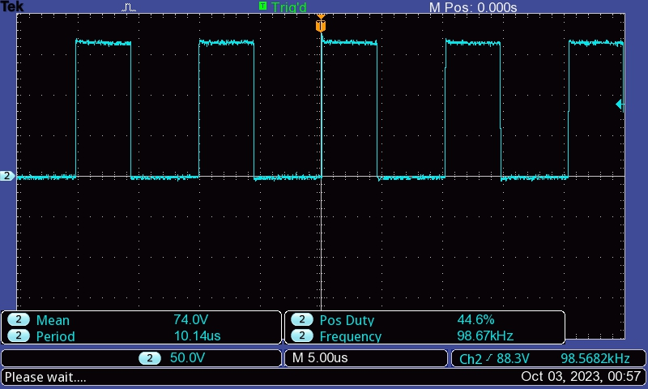
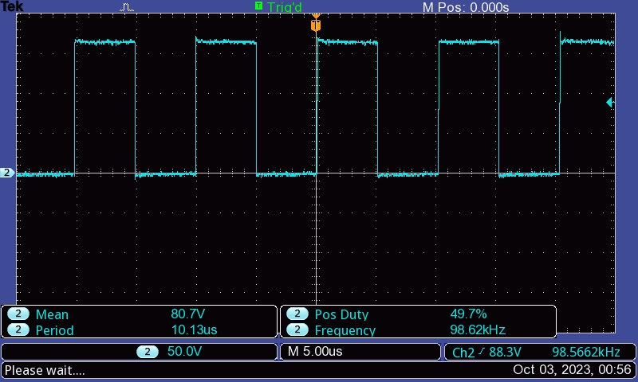
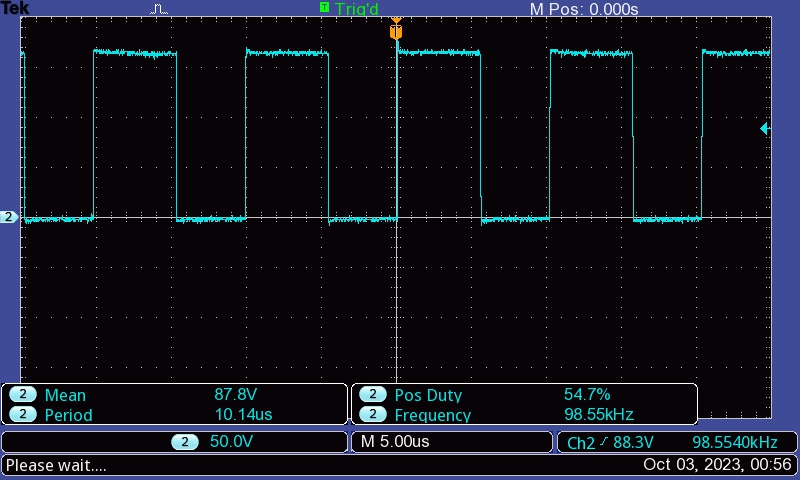

# Embedded Systems Lab Report

* Tanish H Talapaneni [200020050@iitdh.ac.in] 
* Tirumala Reddy B N [ee23mt022@iitdh.ac.in]
* Group: 12  

### Problem Statement:

Part 1:
Create a PWM waveform with frequency = 100KHz and variable duty cycle.
The program should begin with d = 50%.
On pressing one switch the duty should be increased by 5% and on pressing other switch it should be decreased by 5%.

Part 2:
Implement the same but using only 1 switch (SW1 OR SW2) – short press for d increase and long press for decrease.

### Solution Summary:

We used the inbuilt PWM module in order to approach the problem. Alternate functions were selected for the particular ports in order to get PWM output. Values were given to the PWM functions to get respective duty cycle. The duty cycle is changed in the interrupt handler corresponding to GPIO(PortF in this case as they are connected to switches). In order to implement short and long press, systick timers were used. Delay is implemented using systick timer and the input values is checked after delay in between. If input is low(active_low) after the delay as well, it is considered as a long press 

### Assumptions, Constraints and Requirements:

Long press is a press which is for a duration of more than 1 second. For part 2, we have assumed d as 5 percent itself. One corner case might be where give a succesion of short presses. In this case, the duty cycle will reduce only 1 time.  

### Measurements and Results:

System Clock Frequency (f) = 16 MHz
Desired frequency= 100kHz
Thus, clock-divider value(PWM1_3_LOAD_R) = 16MHz/100kHz = 160

For 50 percent duty cycle, compare value(PWM1_3_CMPA_R)= 160*0.5 = 80
offset in compare value when there is 5 percent change in duty cycle= 160*0.05 = 8

Scope waveforms: 
<!---->
<!---->
<!---->

<figure>
  
  <figcaption>45percent_duty_cycle</figcaption>
</figure>

<figure>
  
  <figcaption>50percent_duty_cycle</figcaption>
</figure>

<figure>
  
  <figcaption>55percent_duty_cycle</figcaption>
</figure>

### Discussion and Conclusions:
Without scope, we gave the PWM output to LED pins in order to judge duty cycle roughly by the change in its brightness. Sometimes the duty cycle didn't change as expected.
