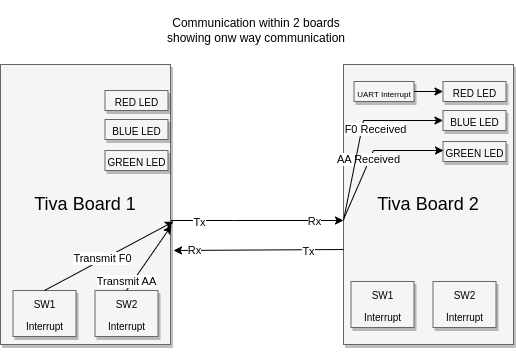
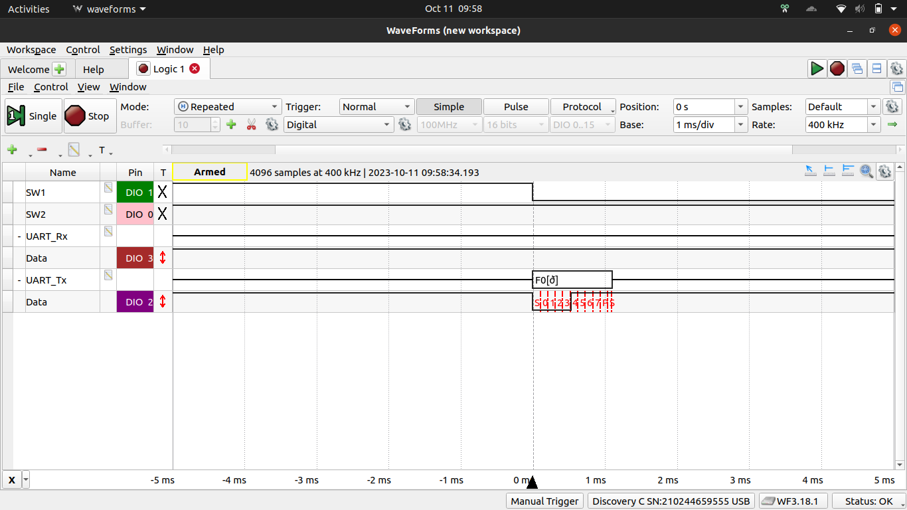
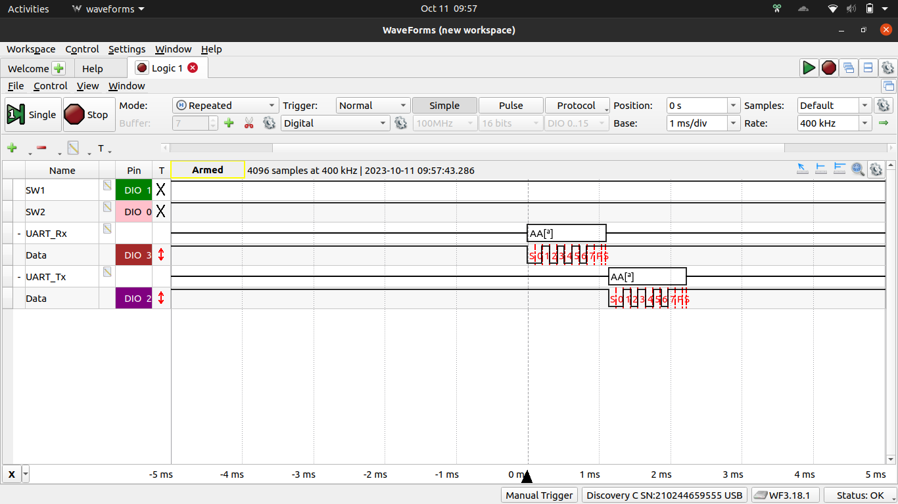
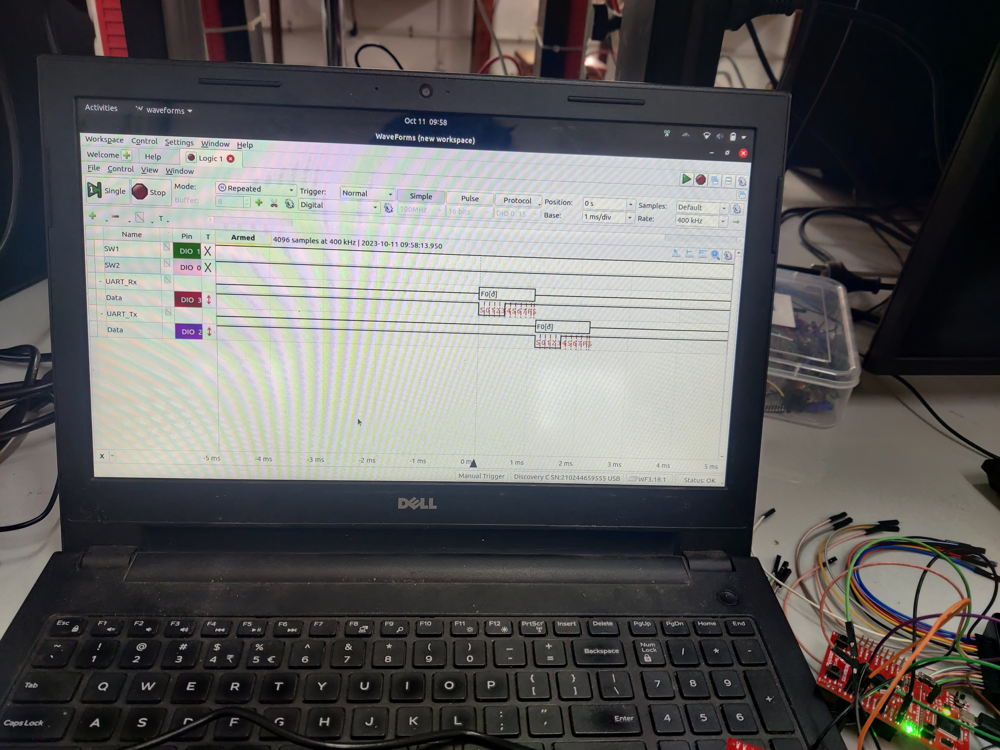
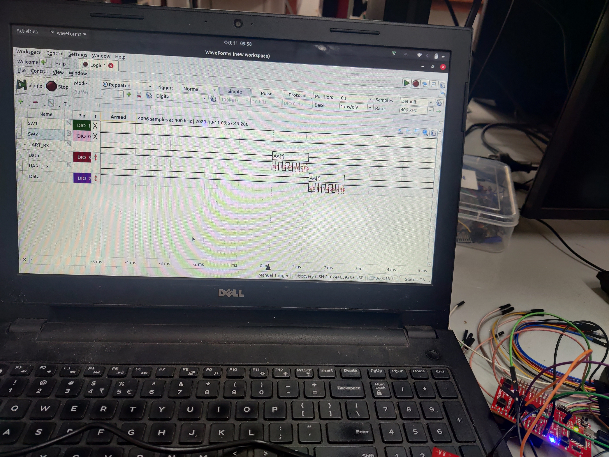

# Embedded Systems Lab Report

* Tanish H Talapaneni [200020050@iitdh.ac.in] 
* Tirumala Reddy B N [ee23mt022@iitdh.ac.in]
* Group: 12  
* 11th Oct 2023

### Problem Statement:

Program your microontroller to transmit:

"F0" if SW1 is pressed

"AA" if SW2 is pressed 

over UART with baud rate 9600 and odd parity. 

Your program should also listen for incoming data on the UART with the same baud and parity config; if "AA" is received LED should be GREEN; if "F0" is recieved, the LED should be BLUE and if any error is detected LED should be RED. Test this by communicating with your neighboring group.

### Solution Summary:

Program consists of 2 parts majorly. One part for transmit and one part for receive. Transmit is done in transmit function, where the Data Register is filled with data to be sent(this data is taken as a parameter by the UART-Transmit function). GPIO Interrupts are enabled and the two switches are configured to send the corresponding data by calling the UART-Transmit function.

The UART reception is enabled always and UART-Receive function is called within a while(1) loop. Inside the receive function, Receive status is checked, and if it is indicated so, specific LED is turned ON according to the data present in the UART-Data register. Also, for testing purposes, the received data is transmitted via transmit pin(kind of like loopback)

UART Interrupt handler is also present, which gets called whenever there is an error in transmission/reception. Inside this interrupt handler, RED LED is turned ON.     

### Assumptions, Constraints and Requirements:

We werent sure about when an error might come up with respect to transmission/reception. One more constraint might be when, lets say, both switches are pressed at the same time. 

### Block diagram / Flowchart:
<figure>
  
  <figcaption>Flowchart</figcaption>
</figure>
 
 
 
 
 

### Measurements and Results:

<figure>
  
  <figcaption>F0 Transmission</figcaption>
</figure>
 
 
 
 
 

<figure>
  
  <figcaption>AA Transmission</figcaption>
</figure>
 
 
 
 
 

<figure>
  
  <figcaption>F0 Reception and transmit back</figcaption>
</figure>
 
 
 
 
 

<figure>
  
  <figcaption>AA Reception and transmit back</figcaption>
</figure>
 
 
 
 
 

<figure>
  
  <figcaption>F0 Reception and transmit back with GREEN LED glowing</figcaption>
</figure>
 
 
 
 
 

<figure>
  
  <figcaption>AA Reception and transmit back with GREEN LED glowing</figcaption>
</figure>
 
 
 
 
 

### Discussion and Conclusions:
We were thus able to communicate within 2 boards with appropriate transmission and reception settings. We were able to observe the appropriate start and stop bits as well in the waveform. We kept the FIFO disabled as we were dealing wih only 1 byte/character transmission.
